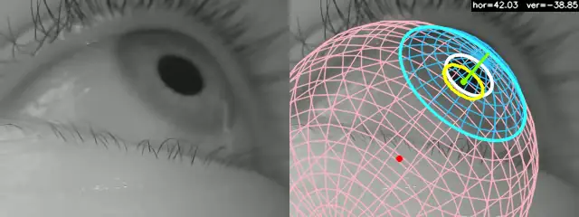
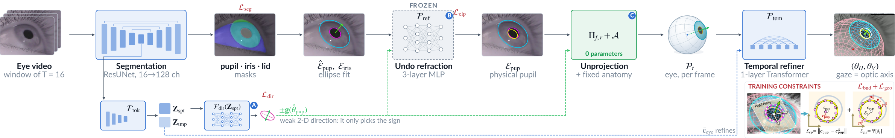
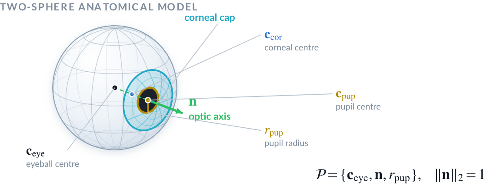

<p align="center">
  <picture>
    <source media="(prefers-color-scheme: dark)" srcset="docs/assets/logo-dark.png">
    
  </picture>
</p>

<h3 align="center">Calibration-free, geometry-aware gaze tracking for clinical video-oculography</h3>

<p align="center">
  <a href="#citation"></a>
  <a href="LICENSE"></a>
  
  
  
</p>

<p align="center">
  <a href="#quick-start">Quick start</a> ·
  <a href="#how-it-works">How it works</a> ·
  <a href="#results">Results</a> ·
  <a href="#outputs">Outputs</a> ·
  <a href="#citation">Citation</a>
</p>

<p align="center">
  
  <br>
  <sub><b>Left:</b> input eye video. <b>Right:</b> the 3-D eye VOGeo-Gaze reconstructs from it, drawn by the tool's own <code>overlay.mp4</code>,
  with the eyeball (pink), cornea (blue), limbus (cyan), detected pupil (white), refraction-corrected pupil (yellow) and gaze (green).
  Real-time playback of an LPW recording, 95 Hz.</sub>
</p>

---

**VOGeo-Gaze** is the official implementation of

> **VOGeo-Gaze: Calibration-Free, Geometry-Aware Deep Learning for Real-Time Gaze Tracking in Clinical Video-Oculography**<br>
> Jingkang Zhao, Seyed-Ahmad Ahmadi, Julian Decker, Peter zu Eulenburg, Andreas Zwergal, Virginia L. Flanagin, Max Wuehr<br>
> *Medical Image Computing and Computer Assisted Intervention (MICCAI) 2026*

Give it a monocular eye video and it returns per-frame horizontal and vertical gaze, the 3-D eyeball
centre, the pupil centre and the pupil size, with **no subject calibration, no camera intrinsics and no
precise gaze labels**.

<table>
  <tr>
    <td align="center" width="25%"><h2>0.33° / 0.35°</h2>median absolute error,<br>horizontal / vertical</td>
    <td align="center" width="25%"><h2>~92 %</h2>of clinical recordings<br>below 1° error</td>
    <td align="center" width="25%"><h2>0</h2>calibration steps<br>per subject</td>
    <td align="center" width="25%"><h2>&gt;300 fps</h2>on a single GPU,<br>2.3 M parameters</td>
  </tr>
</table>

<sub>Evaluated on clinical recordings of 17 patients and 19 healthy subjects against EyeSeeCam, a clinical
gold-standard VOG system; trained only on the public TEyeD dataset. See <a href="#results">Results</a>.</sub>

## Why it is different

Most learned gaze trackers **regress gaze angles** directly, so they need precise gaze labels and
tend not to transfer between cameras. Classical geometric trackers are accurate, but they need a
**per-subject calibration**. VOGeo-Gaze does neither: it reconstructs the physical eye and reads gaze off it.

| Approach | Gaze comes from | Per-subject calibration | Precise gaze labels | Interpretable 3-D eye |
|---|---|:-:|:-:|:-:|
| Analytical geometry (e.g. 3DeepVOG) | a fitted eye model | required | not needed | yes |
| Label-driven learning (e.g. NVGaze, CVL) | regressed angles | not needed | required | no |
| **VOGeo-Gaze** | **the reconstructed eye** | **not needed** | **not needed** | **yes** |

## How it works

<p align="center">
  <a href="docs/assets/pipeline.png"></a>
  <br><sub>Click the figure for full resolution.</sub>
</p>

1. **See the eye.** A ResUNet segments the pupil, iris and open eye in every frame, and ellipses are
   fitted to the pupil and iris.
2. **Undo the cornea.** The camera sees the pupil *through* the cornea, which shifts and magnifies it.
   A small network F<sub>ref</sub>, pre-trained on 10 M+ exact optical simulations and frozen, maps the
   observed pupil back to the physical one.
3. **Reconstruct the eye, not the angle.** With a two-sphere anatomical eye model, the corrected pupil and
   the iris fix the 3-D eye in closed form (0 learned parameters). A weak 2-D direction cue only chooses
   between the two mirror solutions.
4. **Stabilise over time.** A one-layer temporal transformer F<sub>tem</sub> refines the eyeball centre
   over 16-frame clips. Gaze is the optic axis of the reconstructed eye.

<p align="center">
  
</p>

Every output is a physical quantity (the eyeball centre **c**<sub>eye</sub>, the optic axis **n** and the
pupil radius r<sub>pup</sub>, in millimetres), so every result can be checked against the image.

<details>
<summary><b>Paper ↔ code map</b></summary>

| Step (paper, Fig. 2) | Code |
|---|---|
| (a) ResUNet segmentation of pupil, iris and open eye; ellipse fits Ê<sub>pup</sub>, E<sub>iris</sub> | `VOGeoGaze.resunet`, `models/ellipse_fit.py` |
| (b) geometric tokens **Z** = [**Z**<sub>spt</sub> \| **Z**<sub>tmp</sub>]; prior gaze direction F<sub>dir</sub> signs the pupil minor axis (Eq. 1) | `VOGeoGaze.z_spt`, `z_tmp`, `f_dir` |
| (c) refraction-aware ellipse correction F<sub>ref</sub> (Eq. 2) | `models/refraction.py` |
| (e) geometry-constrained eye reconstruction Π<sub>f,r</sub> (Eq. 3) | `models/reconstruction.py`, `geometry/unprojection.py` |
| (f) temporal anatomical stabilisation F<sub>tem</sub> (Eq. 4) | `models/temporal.py` |
| anatomical priors 𝒜 (Table 1) | `geometry/anatomy.py` |

The whole network is `vogeo_gaze/models/vogeo_gaze.py`. The weights (8 MB) ship with the code in
`vogeo_gaze/weights/`.
</details>

## Results

Clinical benchmark from the paper (Table 2). MAE is the median in degrees after per-recording
alignment, with the interquartile range (Q1–Q3) below it; the last column is the share of
recordings below 1° MAE.

| Method | Calibration | Params (M) | FLOPs (G) | MAE<sub>H</sub> (°) | MAE<sub>V</sub> (°) | < 1° (H / V, %) |
|---|:-:|:-:|:-:|:-:|:-:|:-:|
| 3DeepVOG | yes | 1.6 | 9.1 | **0.29**<br><sub>0.14–0.54</sub> | **0.27**<br><sub>0.17–0.56</sub> | **93.9 / 93.9** |
| IrisFit | yes | 1.6 | 9.1 | 0.48<br><sub>0.27–0.83</sub> | 0.80<br><sub>0.55–1.18</sub> | 78.3 / 61.7 |
| NVGaze | no | 0.16 | 0.074 | 2.33<br><sub>1.77–3.05</sub> | 2.41<br><sub>1.74–3.07</sub> | 6.1 / 7.0 |
| CVL (Gaze) | no | 3.86 | 22.6 | 2.30<br><sub>1.51–3.17</sub> | 2.34<br><sub>1.77–3.08</sub> | 6.1 / 5.2 |
| CVL (Seg) | no | 3.86 | 22.6 | 2.80<br><sub>2.20–4.18</sub> | 2.08<br><sub>1.41–2.95</sub> | 4.3 / 11.3 |
| CVL (All) | no | 3.86 | 22.6 | 1.91<br><sub>1.26–3.63</sub> | 2.66<br><sub>1.90–3.88</sub> | 17.4 / 4.3 |
| **VOGeo-Gaze** | **no** | 2.3 | 9.2 | *0.33*<br><sub>0.19–0.60</sub> | *0.35*<br><sub>0.21–0.60</sub> | *92.2 / 91.3* |

**Bold**: best; *italic*: second best. VOGeo-Gaze is the only calibration-free method that reaches
sub-degree accuracy, and it stays within 0.1° of the calibrated 3DeepVOG.

## Quick start

### Install

Python 3.10 or newer; tested with Python 3.11, PyTorch 2.5 and CUDA 12.1.

```bash
git clone https://github.com/DSGZ-MotionLab/VOGeo-Gaze.git
cd VOGeo-Gaze
pip install .          # or: pip install -r requirements.txt
```

A CUDA GPU is recommended. The CPU also works, at about 25 frames/s.

### Run

```bash
python -m vogeo_gaze data/video.mp4               # -> data/vogeo_results/video/
python -m vogeo_gaze a.mp4 b.avi --out-dir out    # -> out/a/, out/b/
```

After `pip install .`, `vogeo-gaze` is the same command. Progress bars show frames/s for the network
pass and the overlay.

### Python API

```python
from vogeo_gaze import Engine, Options, load_model

Engine(load_model(), Options()).run([("video.mp4", "video_vogeo")])
```

`load_model()` returns the `torch.nn.Module`. Its input is a clip of shape (B, T, 3, 240, 320) with
values in [0, 1], and it returns per-frame tensors of shape (B, T, …).

## Outputs

Each video produces the following in `<out-dir>/<video name>/`. By default `<out-dir>` is
`vogeo_results/` next to the video.

| File | Content |
|---|---|
| `gaze.csv` | per-frame gaze, eye parameters, ellipses and confidences |
| `overlay.mp4` | input beside the fitted eye (as in the animation above) |
| `run_info.json` | settings, eyeball centre and throughput |
| `segmentation.mp4` | segmentation and detected ellipses (with `--seg-video`) |

**Overlay legend.** White: detected entrance pupil Ê<sub>pup</sub>. Yellow: its rim refracted through the
fitted cornea onto the pupil plane. Cyan: limbus of the fitted eye. Pink and blue: eyeball and cornea
wireframes. Red dot: eyeball centre. Green: pupil centre and gaze. The fitted-eye elements are dimmed
on frames where `gaze_ok` is 0.

**One eyeball centre per recording.** F<sub>tem</sub> estimates one eyeball centre per clip of 16 frames
(Eq. 4). Assuming the eye does not move relative to the camera during a recording, the median of these
clip centres is used as the eyeball centre of the whole recording. Every frame's refraction-corrected
pupil ray is then lifted onto the eyeball sphere about that centre, which gives its gaze.

<details>
<summary><b><code>gaze.csv</code> columns</b></summary>

3-D quantities are in millimetres in the camera frame: x to the image right, y image down, z along the
optical axis. Pixel quantities refer to the 320 × 240 model canvas.

| Column | Meaning |
|---|---|
| `frame`, `timestamp` | source frame index; seconds |
| `theta_h`, `theta_v` | gaze angles θ<sub>H</sub> = atan2(g<sub>x</sub>, −g<sub>z</sub>), θ<sub>V</sub> = asin(g<sub>y</sub>), in degrees |
| `gaze_x/y/z` | unit gaze vector (optic axis **n**) |
| `c_eye_x/y/z` | eyeball centre **c**<sub>eye</sub> |
| `c_pup_x/y/z`, `r_pup` | pupil centre **c**<sub>pup</sub> and radius r<sub>pup</sub> |
| `pupil_conf`, `iris_conf` | ellipse-fit confidence in [0, 1] |
| `open_eye_score`, `blink_index` | share of the iris inside the open eye; running blink id (0 = open, blink when the score < 0.7) |
| `entpup_theta/cx/cy/a/b` | detected entrance-pupil ellipse Ê<sub>pup</sub> (rad, px) |
| `iris_theta/cx/cy/a/b` | detected iris ellipse E<sub>iris</sub> (rad, px) |
| `gaze_ok` | 0 where the pupil ray missed the eyeball sphere and the clip's gaze was kept |
</details>

<details>
<summary><b>Command-line options</b></summary>

| Option | Meaning |
|---|---|
| `--source-fpx F` | native focal length of the camera in pixels, if known (see below) |
| `--start N`, `--frames N` | process a frame range |
| `--batch N` | videos per forward pass |
| `--no-video`, `--no-mesh`, `--overlay-only` | overlay output |
| `--seg-video` | also write `segmentation.mp4` |
| `--weights`, `--device`, `--autocast` | other weights, `cpu`, fp16 on CUDA |
</details>

<details>
<summary><b>Camera and frame rate</b></summary>

The model uses a pinhole camera with a focal length of 1066.7 px at the 320 × 240 canvas. By default
each video is scaled to fill the canvas, which implies a native focal length of 1066.7 px divided by
that scale; the run prints this value. If the native focal length is known, `--source-fpx` resamples
the video to the model's focal length instead. Gaze angles are robust to this assumption; absolute
depths in millimetres are not.

F<sub>tem</sub> was trained at about 12 Hz. Faster videos are therefore read in clips of 16 × *s*
frames, with *s* = round(fps / 12), and every *s*-th frame feeds F<sub>tem</sub>. Segmentation,
ellipse fits and reconstruction still run on every frame.
</details>

### Speed

Single RTX 4090, one video at a time, including video decoding:

| Video | Network pass | Overlay drawing (CPU) |
|---|---|---|
| 640 × 480, 95 Hz | 590 frames/s | 720 frames/s |
| 188 × 120, 220 Hz | 800 frames/s | 750 frames/s |

## Repository layout

```
vogeo_gaze/
├── models/      # VOGeoGaze network, F_ref, reconstruction Π, F_tem, ellipse fitting
├── geometry/    # anatomical priors, camera, unprojection, rendering
├── runtime/     # video I/O, inference engine, recording centre, CSV records, overlay
├── weights/     # vogeo_gaze_miccai2026.pt (8 MB)
└── cli.py       # the vogeo-gaze command
```

## Citation

If you use VOGeo-Gaze in your research, please cite:

```bibtex
@InProceedings{ZhaJin_VOGeoGaze_MICCAI2026,
  author    = {Zhao, Jingkang and Ahmadi, Seyed-Ahmad and Decker, Julian and zu Eulenburg, Peter
               and Zwergal, Andreas and Flanagin, Virginia L. and Wuehr, Max},
  title     = {{VOGeo-Gaze: Calibration-Free, Geometry-Aware Deep Learning for Real-Time Gaze
               Tracking in Clinical Video-Oculography}},
  booktitle = {Medical Image Computing and Computer Assisted Intervention -- MICCAI 2026},
  year      = {2026},
  publisher = {Springer Nature Switzerland},
  volume    = {LNCS 16896}
}
```

## Acknowledgements

The model is trained on the public [TEyeD](https://arxiv.org/abs/2102.02115) dataset. The example
video in the animation above is from the public LPW dataset (Tonsen et al., *Labelled pupils in the
wild*, ETRA 2016). The two-sphere eye model follows Dierkes et al. (ETRA 2018).

## License

Apache License 2.0; see [`LICENSE`](LICENSE).
